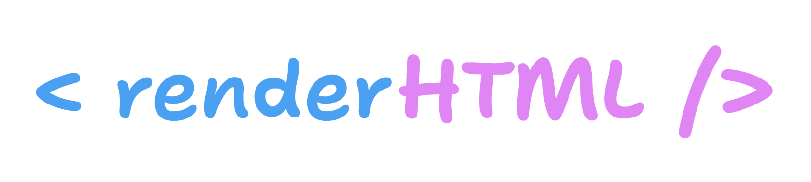

<!-- <p align="center"> -->
  
<!-- </p> -->

# renderHTML

**renderHTML** es un paquete de Go para **generar HTML desde el servidor**, pensado para quienes aman escribir código limpio, legible y alineado con las prácticas de los sistemas hypermedia.

Inspirado en el espíritu simple de la web, evita dependencias innecesarias y se enfoca en que tus vistas sean tan claras y mantenibles como tu backend.

## Instalación

```sh
go get -u github.com/hypermediastack/renderHTML
```

## ¿Qué hace?

- Permite **crear árboles de elementos HTML** de forma declarativa y tipada en Go.
- Se vuelve tan natural como escribir HTML de manera nativa, pero con todas las ventajas del tipado fuerte, autocompletado y refactoring seguro.
- Facilita el manejo de atributos, clases, estilos y eventos con métodos intuitivos.
- Perfecto para aplicaciones server-side que generan HTML dinámico sin depender de frameworks JavaScript complejos.

## Ejemplo de uso
```Go
package main

import (
	. "renderHtml"
)

func viewRoot() fmt.Stringer {
	return Html().Lang("en").AddContent(
		Head(
            // title
			Title("Testing app"),

			// favicon
			Link().Rel("shortcut icon").Href("media/imgs/favicon.ico"),

			// metadata
			Meta().CharSet("UTF-8"),
			Meta().Name("viewport").Content("width=device-width, initial-scale=1.0"),
			Meta().HttpEquiv("X-UA-Compatible").Content("IE=edge"),
			Meta().HttpEquiv("pragma").Content("no-cache"),
			Meta().HttpEquiv("expires").Content("-1"),

			// css
			Link().Rel("stylesheet").Href("css/styles.css"),

			// javascript
			Script().Defer().Src("js/htmx.min.js"),
		),
		Body(
            H1("Page title"),
            P("Hello world!"),
        ),
	)
}
```

El código Golang anterior produce el siguiente texto HTML:

```html
<!DOCTYPE html><html lang="en"><head><title>Testing app</title><link rel="shortcut icon" href="media/imgs/favicon.ico"/><meta charset="UTF-8"/><meta name="viewport" content="width=device-width, initial-scale=1.0"/><meta http-equiv="X-UA-Compatible" content="IE=edge"/><meta http-equiv="pragma" content="no-cache"/><meta http-equiv="expires" content="-1"/><link rel="stylesheet" href="css/styles.css"/><script defer src="js/htmx.min.js"></script></head><body><h1>Page title</h1><p>Hello world!</p></body></html>
```

## Ventajas de usar renderHTML

- **100% tipado:** Olvídate de strings mágicos y errores tontos por tags mal cerrados.
- **Legible y mantenible:** El código HTML es un árbol de funciones y métodos en Go, fácil de leer y refactorizar.
- **Flexibilidad total:** Es posible agregar atributos, clases, estilos y contenido dinámico en cualquier elemento, usando métodos encadenados.
- **Eventos nativos:** Soporta atributos `on*` para manejar eventos nativos de HTML.
- **Extensible:** Permite sumar atributos personalizados y estructuras propias si es necesario ampliar el paquete.
- **Sin magia, sin dependencias:** Es puro Go, sin reflexiones raras ni inyecciones de código.
- **Sin dependencias de paquetes de terceros:** No posee ni utiliza paquetes de terceras partes, solo de la librería estandad.
- **Filosofía hypermedia:** Pensado para construir sistemas web siguiendo las mejores prácticas clásicas de la web, manteniendo el control y la transparencia de cada respuesta.

## Funcionamiento
1 - Puede importar el paquete sin utilizar un nombre de prefijo: ```import . "renderHTML" ```.

Al hacer esto, cada vez que escriba un nombre de elemento HTML, no deberá anteponer el nombre del paquete. 

2 - Todos los atributos HTML están representados. Todos tienen ayuda y todos tienen un link de referencia a https://developer.mozilla.org.

3 - Al presionar punto ("."), su editor de texto le propondrá todos los atributos que este elemento posee. Pudiendo encadenar todos los atributos. Puede despreocuparse de cometer un error de tipeo. Además, no debe recordar todos los atributos que posee cada elemento HTML; este paquete lo hace por usted.

4 - Todos los elementos que no sean "vacíos", poseen dos mecanismos para incluír contenido.
- La opción tradicional es utilizando el parámetro del elemento.
  Ejemplo:
    ```Go
  H1("Título")
  Div(
        P("Párrafo línea uno"),
        P("Párrafo línea dos"),
  )
  ```

- La segunda opción es utilizar el método ```AddContent(content ...any)```.

    Sucede con frecuencia, que cada elemento requiere atributos propios: "id", "class", "name"; etc. Por esta razón es conveniente utilizar ```AddContent(...)``` para lograr ver el contenido de manera similar como en HTML nativo.
    ```Go
    H1().Class("title").Id("title-page").AddContent("Title")
    Div().Class("card").Id("card-one").AddContent(
        P().Id("p-one").Class("help").AddContet("Line one"),
        P("Line two").Id("p-two").Class("help"),
    )

## Contribuir

¡Se aceptan sugerencias!

Si tienes nuevas ideas, encontrás algún error de programación o simplemente querés sumar tu experiencia hypermedia, sos más que bienvenida/o.

Por favor, contactate por email a: fabianpallares@gmail.com

## Licencia

Este proyecto está bajo licencia MIT.  
Consulta el archivo [LICENSE](LICENSE) para más información.

> **renderHTML:** Hecho con amor, para que la web siga siendo simple, potente y divertida.
